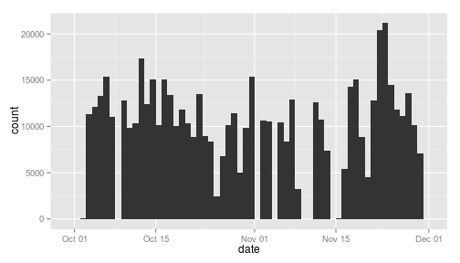
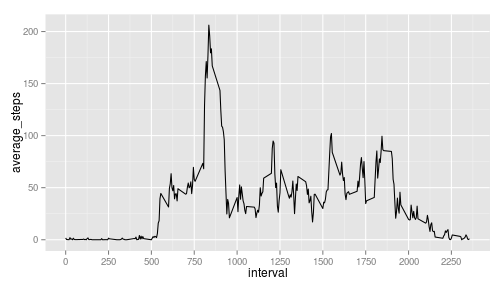
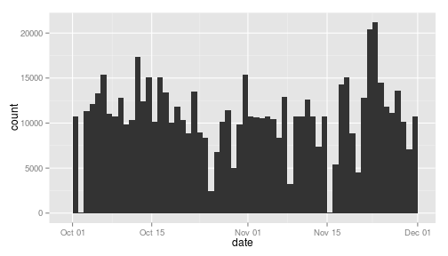
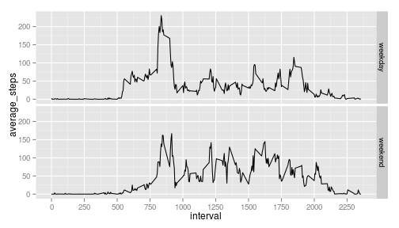

Peer Assessment 1
========================================================

Load the required packages

```r
library(dplyr)
library(ggplot2)
```

## Loading and preprocessing the data

Load the data and convert the date variable:

```r
dat <- read.csv("activity.csv")
dat$date <- as.Date(dat$date, "%Y-%m-%d")
```

## What is mean total number of steps taken per day?

1. Calculate the total number of steps taken per day

```r
totals <- summarise(group_by(dat, date), totalsteps=sum(steps, na.rm=TRUE))
head(totals)
```

```
## Source: local data frame [6 x 2]
## 
##         date totalsteps
## 1 2012-10-01          0
## 2 2012-10-02        126
## 3 2012-10-03      11352
## 4 2012-10-04      12116
## 5 2012-10-05      13294
## 6 2012-10-06      15420
```

2. Make a histogram of the total number of steps taken each day

```r
qplot(date, data=totals, weight=totalsteps, geom="histogram", binwidth=1)
```

 

3. Calculate and report the mean and median of the total number of steps taken per day

```r
tsmean <- round(mean(totals$totalsteps), 2)
tsmedian <- median(totals$totalsteps)
```
The mean of the total number of steps taken per day is 9354.23, and the median is 10395.

## What is the average daily activity pattern?

1. Make a time series plot of the 5-minute interval (x-axis) and the average number of steps taken, averaged across all days (y-axis)

```r
averages <- summarise(group_by(dat, interval), average_steps=mean(steps, na.rm=TRUE))
p <- ggplot(averages, aes(x=interval, y=average_steps))
p + geom_line() + scale_x_continuous(breaks=seq(0,2250,250))
```

 

2. Which 5-minute interval, on average across all the days in the dataset, contains the maximum number of steps?

```r
maxinter <- averages$interval[which.max(averages$average_steps)]
```
The 5-interval that contains the maximum number of steps, on average, is 835.

## Imputing missing values
1. Calculate and report the total number of missing values in the dataset (i.e. the total number of rows with NAs)

```r
numNA <- sum(is.na(dat$steps))
```
The total number of missing values is 2304.

2. Devise a strategy for filling in all of the missing values in the dataset. The strategy does not need to be sophisticated.   
The following is a function that replaces a NA value with the average of steps for the interval:

```r
fillNA <- function(dat){
  if (is.na(dat$steps)){
    dat$steps <- averages$average_steps[averages$interval == dat$interval]
    return(dat)
  }
}
```

3. Create a new dataset that is equal to the original dataset but with the missing data filled in.

```r
newdat <- dat
repind <- which(is.na(newdat$steps))
for (i in repind){
  newdat[i,] <- fillNA(newdat[i,])
}
```

4. Make a histogram of the total number of steps taken each day and Calculate and report the mean and median total number of steps taken per day.

```r
newtotals <- summarise(group_by(newdat, date), totalsteps=sum(steps))
qplot(date, data=newtotals, weight=totalsteps, geom="histogram", binwidth=1)
```

 

```r
newmean <- round(mean(newtotals$totalsteps), 2)
newmedian <- median(newtotals$totalsteps)
```
The new value of the mean of the total number of steps taken per day is 1.076619 &times; 10<sup>4</sup>, and the new value of the median is 1.0766189 &times; 10<sup>4</sup>.

Do these values differ from the estimates from the first part of the assignment? 

```r
meandiff <- abs(tsmean-newmean)
mediandiff <- abs(tsmedian-newmedian)
```
The difference between the first mean and the new one is 1411.96 steps, and the difference between the first median and the new one is 371.1886792.

What is the impact of imputing missing data on the estimates of the total daily number of steps?

```r
totaldiff <- sum(newtotals$totalsteps - totals$totalsteps)
```
When imputing missing data, the total number of steps increases in 8.6129509 &times; 10<sup>4</sup> steps.

## Are there differences in activity patterns between weekdays and weekends?
1. Create a new factor variable in the dataset with two levels – “weekday” and “weekend” indicating whether a given date is a weekday or weekend day.

```r
enddays <- c("Saturday", "Sunday")
dayvec <- weekdays(newdat$date)
newdat$day[dayvec %in% enddays] <- "weekend"
newdat$day[!(dayvec %in% enddays)] <- "weekday"
newdat$day <- as.factor(newdat$day)
head(newdat)
```

```
##       steps       date interval     day
## 1 1.7169811 2012-10-01        0 weekday
## 2 0.3396226 2012-10-01        5 weekday
## 3 0.1320755 2012-10-01       10 weekday
## 4 0.1509434 2012-10-01       15 weekday
## 5 0.0754717 2012-10-01       20 weekday
## 6 2.0943396 2012-10-01       25 weekday
```

2. Make a panel plot containing a time series plot (i.e. type = "l") of the 5-minute interval (x-axis) and the average number of steps taken, averaged across all weekday days or weekend days (y-axis). 

```r
newaverages <- summarise(group_by(newdat, interval, day), average_steps=mean(steps, na.rm=TRUE))
p <- ggplot(newaverages, aes(x=interval, y=average_steps))
p + geom_line() + scale_x_continuous(breaks=seq(0,2250,250)) + facet_grid(day ~ .)
```

 
